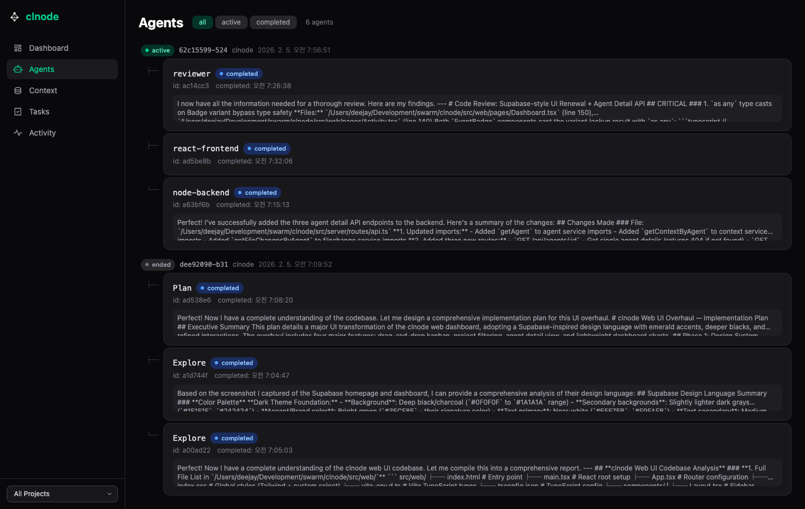
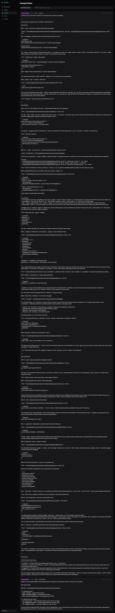
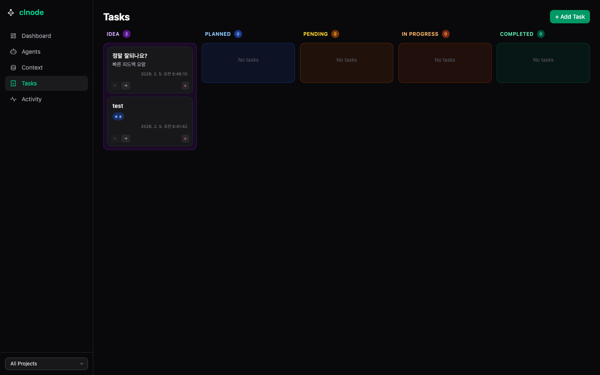
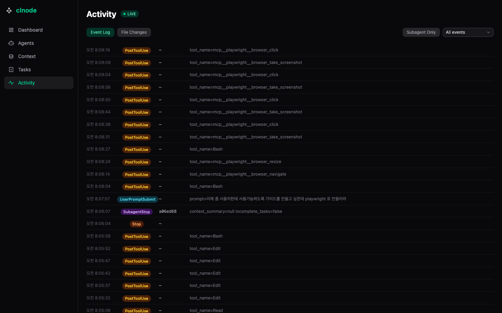

# clnode 사용 가이드

> [English README](../README.md) | [한국어 README](../README.ko.md) | [English Guide](./GUIDE.en.md)

Claude Code에서 멀티에이전트를 돌릴 때, 에이전트끼리 결과를 주고받을 수 없어서 Leader의 컨텍스트가 폭발하는 문제를 해결하는 플러그인입니다.

---

## 목차

1. [사전 준비](#사전-준비)
2. [설치](#설치)
3. [데몬 시작](#데몬-시작)
4. [프로젝트 초기화 (clnode init)](#프로젝트-초기화)
5. [Agents, Skills, Rules 이해하기](#agents-skills-rules-이해하기)
6. [커스텀 에이전트 만들기](#커스텀-에이전트-만들기)
7. [Claude Code에서 사용하기](#claude-code에서-사용하기)
8. [Web UI 대시보드](#web-ui-대시보드)
9. [CLI 명령어 전체](#cli-명령어-전체)
10. [트러블슈팅](#트러블슈팅)

---

## 사전 준비

| 항목 | 최소 버전 | 설치 방법 |
|------|----------|----------|
| **Node.js** | v22 이상 | [nodejs.org](https://nodejs.org) 또는 `nvm install 22` |
| **pnpm** | v10 이상 | `npm install -g pnpm` |
| **jq** | any | `brew install jq` (macOS) / `apt install jq` (Ubuntu) |
| **Claude Code** | 최신 | [claude.com/claude-code](https://claude.com/claude-code) |

`jq`와 `curl`은 hook.sh가 JSON 파싱과 HTTP 호출에 사용합니다. curl은 대부분의 시스템에 기본 설치되어 있습니다.

---

## 설치

Claude Code에서 다음 명령어를 실행하세요:

```
curl -s https://raw.githubusercontent.com/SierraDevsec/clnode/main/docs/installation.md
```

Claude가 가이드를 읽고 자동으로 설치합니다.

### 수동 설치

자동 설치가 안 될 경우:

```bash
# 프로젝트 디렉토리에서
npx clnode init .

# 대시보드 열기
npx clnode ui
```

> 개발자용 설치(git clone)는 [README](../README.md#for-development)를 참고하세요.

---

## 데몬 시작

clnode는 백그라운드 데몬으로 동작합니다. Claude Code 세션과 독립적으로 실행됩니다.

```bash
clnode start
# [clnode] Daemon started (PID: 12345, Port: 3100)
```

기본 포트는 **3100**입니다. 변경하려면:

```bash
clnode start --port 3200
# 또는
CLNODE_PORT=3200 clnode start
```

데몬 상태 확인:

```bash
clnode status
# Active sessions: 0
# Active agents: 0
```

데몬 중지:

```bash
clnode stop
# [clnode] Daemon stopped
```

---

## 프로젝트 초기화

`clnode init`은 대상 프로젝트에 Claude Code hooks를 설치합니다.

### 기본 초기화

```bash
clnode init /path/to/your/project
```

이 명령이 하는 일:
1. `hook.sh`에 실행 권한 부여
2. `templates/hooks-config.json`을 읽고, hook.sh의 절대 경로로 치환
3. 대상 프로젝트의 `.claude/settings.local.json`에 hooks 설정 작성
4. 데몬이 실행 중이면 프로젝트를 DB에 등록

### 스킬 템플릿 포함 초기화

```bash
clnode init /path/to/your/project --with-skills
```

`templates/` 디렉토리의 agents, skills, rules를 프로젝트의 `.claude/` 디렉토리로 복사합니다.

**복사되는 파일:**
```
.claude/
├── agents/           # 에이전트 정의 (5개)
│   ├── backend-dev.md
│   ├── frontend-dev.md
│   ├── reviewer.md
│   ├── test-writer.md
│   └── architect.md
├── skills/           # 스킬 (3개)
│   ├── compress-output/SKILL.md
│   ├── compress-review/SKILL.md
│   └── clnode-agents/SKILL.md
└── rules/            # 자동 로드 규칙 (5개)
    ├── team.md
    ├── typescript.md
    ├── react.md
    ├── nodejs.md
    └── swarm-context.md
```

### 초기화 후 반드시 해야 할 것

**Claude Code 세션을 재시작하세요.** hooks는 세션 시작 시점에 로드되므로, `clnode init` 후 반드시 세션을 재시작해야 hooks가 활성화됩니다.

---

## Agents, Skills, Rules 이해하기

Claude Code는 세 가지 유형의 설정 파일을 지원합니다. 각각 다른 역할을 합니다:

### 개념 비교

| 파일 위치 | 역할 | 로드 시점 | 내용 |
|----------|------|----------|------|
| `.claude/agents/*.md` | **에이전트 정의** | Task 도구로 에이전트 생성 시 | 메타데이터 (이름, 도구, 모델) + 기본 지침 |
| `.claude/skills/*/SKILL.md` | **스킬** | `/skill-name` 호출 또는 에이전트 frontmatter 프리로드 | 에이전트 출력 압축, 에이전트 생성 가이드 |
| `.claude/rules/*.md` | **자동 규칙** | 모든 대화에 자동 로드 | 프로젝트 전반 규칙, 컨벤션, 제약 |

### 예시로 보는 차이

```
┌─────────────────────────┬─────────────────────────┬────────────────────────────────────────┐
│ 파일                     │ 역할                    │ 내용 예시                               │
├─────────────────────────┼─────────────────────────┼────────────────────────────────────────┤
│ rules/typescript.md     │ 자동 로드 규칙          │ strict 모드, import 순서, 네이밍 규칙    │
├─────────────────────────┼─────────────────────────┼────────────────────────────────────────┤
│ skills/usage/SKILL.md   │ 사용자 호출 스킬        │ /usage 명령으로 토큰 사용량 분석         │
├─────────────────────────┼─────────────────────────┼────────────────────────────────────────┤
│ agents/backend-dev.md   │ 에이전트 정의           │ 백엔드 에이전트 역할, 책임, 가이드라인    │
└─────────────────────────┴─────────────────────────┴────────────────────────────────────────┘
```

### 언제 무엇을 쓰나?

- **rules**: 모든 대화에 항상 적용되어야 하는 규칙 (코드 스타일, 프로젝트 컨벤션)
- **skills**: `/skill-name` 명령으로 호출하거나 에이전트 frontmatter에서 프리로드하는 기능 (예: compress-output, compress-review)
- **agents**: 멀티에이전트 모드에서 Task 도구로 생성되는 에이전트의 정의

### clnode 제공 템플릿

| 에이전트 | 역할 | 권장 모델 |
|---------|------|----------|
| `backend-dev` | API, DB, 비즈니스 로직 | Sonnet |
| `frontend-dev` | UI 컴포넌트, 상태 관리 | Sonnet |
| `reviewer` | 코드 리뷰, 품질 검사 | Opus |
| `test-writer` | 테스트 작성 | Sonnet |
| `architect` | 설계, 의사결정 | Opus |

---

## 커스텀 에이전트 만들기

프로젝트에 맞는 커스텀 에이전트를 만들 수 있습니다.

### 1. 에이전트 정의 생성

`.claude/agents/my-agent.md`:

```markdown
---
name: my-agent
description: 프로젝트 전용 에이전트 설명
tools: Read, Edit, Write, Bash, Grep, Glob
model: sonnet
---

당신은 [역할]을 담당하는 에이전트입니다.

## 책임
- 첫 번째 책임
- 두 번째 책임

## 가이드라인
- 기존 패턴을 따르세요
- 타입 안전한 코드를 작성하세요

## 완료 시
작업 요약을 제공하세요:
1. 무엇을 만들었는지
2. 어떤 파일을 수정했는지
3. 알려진 제한사항
```

### 2. (선택) 사용자 호출 스킬 추가

`/skill-name` 명령으로 호출할 수 있는 스킬을 `.claude/skills/my-skill/SKILL.md`에 작성합니다.

스킬은 YAML frontmatter를 포함해야 합니다:
```yaml
---
name: my-skill
description: 스킬 설명 (Claude가 언제 사용할지 판단용)
version: 1.0.0
---
```

### 3. (선택) 프로젝트 규칙 추가

모든 에이전트가 따라야 할 규칙을 `.claude/rules/my-rule.md`에 작성합니다.

### 기존 프로젝트 파일 활용

**이미 프로젝트에 `.claude/agents/`, `.claude/skills/`, `.claude/rules/` 디렉토리가 있다면**, `clnode init --with-skills`는 기존 파일을 덮어쓰지 않고 없는 파일만 복사합니다.

자신만의 에이전트 구성을 유지하면서 clnode의 기본 템플릿을 보완할 수 있습니다.

---

## Claude Code에서 사용하기

초기화가 끝나면 **별도 설정 없이 자동으로 동작**합니다.

### 자동으로 일어나는 일

| 이벤트 | 동작 |
|--------|------|
| **세션 시작** | 세션이 DB에 등록됨, 프로젝트와 연결 |
| **에이전트 시작** (SubagentStart) | 에이전트가 DB에 등록됨, 이전 에이전트의 결과가 `additionalContext`로 자동 주입 |
| **에이전트 종료** (SubagentStop) | 에이전트의 작업 요약이 transcript에서 추출되어 DB에 저장 |
| **도구 사용** (PostToolUse) | Edit/Write 등 파일 변경이 추적됨, 활동 로그에 기록 |
| **사용자 프롬프트** (UserPromptSubmit) | 프로젝트 컨텍스트(활성 에이전트, 미완료 태스크, 최근 결정)가 자동 첨부 |

### 스마트 컨텍스트 주입

새 에이전트가 시작될 때 clnode가 자동으로 주입하는 컨텍스트:

- **형제 에이전트 요약** — 같은 부모 아래 다른 에이전트가 한 일
- **같은 역할 히스토리** — 이전에 같은 유형의 에이전트가 한 일
- **크로스 세션 컨텍스트** — 같은 프로젝트의 이전 세션 요약
- **태그된 컨텍스트** — 특정 에이전트를 위해 태그된 항목
- **할당된 태스크** — 해당 에이전트에게 할당된 미완료 태스크

### 예시 워크플로우

```
사용자: "API 서버에 인증 기능을 추가해줘"

Leader (Opus):
  ├── backend-dev (Sonnet): auth 미들웨어 + JWT 구현
  │     → 완료 후 요약이 DB에 저장
  ├── test-writer (Sonnet): 테스트 작성
  │     → 시작 시 backend-dev의 요약을 자동으로 받음
  └── reviewer (Opus): 코드 리뷰
        → 시작 시 backend-dev + test-writer의 요약을 자동으로 받음
```

Leader가 중간 결과를 일일이 전달할 필요가 없습니다. DB가 대신합니다.

---

## Web UI 대시보드

```bash
clnode ui
# 브라우저에서 http://localhost:3100 자동 열림
```

또는 직접 `http://localhost:3100`에 접속합니다.

### Dashboard

세션, 에이전트, 컨텍스트, 파일 변경 등 전체 통계를 한눈에 보여줍니다. WebSocket으로 실시간 업데이트됩니다.


### Agents

세션별 에이전트 트리를 보여줍니다. 에이전트를 클릭하면 상세 정보(요약, 컨텍스트, 파일 변경)가 펼쳐집니다. 좀비 에이전트는 **Kill** 버튼으로 정리할 수 있습니다.



### Context Store

에이전트가 저장한 컨텍스트 항목을 세션별로 탐색합니다. 내용, 타입, 태그로 검색 가능합니다. 이것이 에이전트 간 통신의 실체입니다.



### Tasks (Kanban)

5단계 칸반 보드: **Idea → Planned → Pending → In Progress → Completed**. 카드를 드래그앤드롭으로 이동하거나 화살표 버튼을 사용합니다. 색상 태그와 댓글을 추가할 수 있습니다.

**태스크 등록**: Claude Code에서 자연어로 등록하거나, Web UI에서 **+ Add** 버튼으로 직접 등록합니다.

```
사용자: "인증 기능 추가를 태스크로 등록해줘"
→ Claude가 clnode API를 호출해서 태스크 카드 생성
```

**태스크 실행**: 등록된 태스크를 Claude Code에게 실행하라고 지시합니다.

```
사용자: "칸반 보드에 있는 '인증 기능 추가' 태스크 진행해줘"
→ Claude가 에이전트를 생성해서 작업 시작
→ 에이전트 시작 시 해당 태스크가 자동으로 할당되어 additionalContext에 포함
→ 작업 완료 시 태스크 상태가 자동으로 Completed로 변경
```

Web UI 칸반 보드에서 카드를 드래그하거나 화살표 버튼으로 상태를 수동으로 변경할 수도 있습니다.



### Activity

모든 hook 이벤트의 실시간 로그입니다. 이벤트 타입별 필터, 에이전트 전용 보기, 파일 변경 탭을 제공합니다.



### 프로젝트 필터

사이드바 하단의 드롭다운으로 프로젝트를 선택하면 모든 페이지가 해당 프로젝트의 데이터만 표시합니다.

---

## CLI 명령어 전체

| 명령어 | 설명 |
|--------|------|
| `clnode start` | 데몬 시작 (백그라운드, 기본 포트 3100) |
| `clnode start --port 3200` | 커스텀 포트로 시작 |
| `clnode stop` | 데몬 중지 |
| `clnode status` | 활성 세션, 에이전트 수 표시 |
| `clnode init [path]` | 대상 프로젝트에 hooks 설치 + DB 등록 |
| `clnode init [path] --with-skills` | hooks + agents/skills/rules 템플릿 복사 |
| `clnode ui` | 브라우저에서 Web UI 열기 |
| `clnode logs` | 데몬 로그 보기 |
| `clnode logs -f` | 데몬 로그 실시간 팔로우 |
| `clnode logs -n 100` | 최근 100줄 로그 보기 |

환경 변수:

| 변수 | 기본값 | 설명 |
|------|--------|------|
| `CLNODE_PORT` | `3100` | 데몬 포트 |

---

## 트러블슈팅

### hooks가 동작하지 않아요

`clnode init` 후 **Claude Code 세션을 재시작**했는지 확인하세요. hooks는 세션 시작 시에만 로드됩니다.

### 데몬이 시작되지 않아요

포트가 이미 사용 중일 수 있습니다:

```bash
lsof -i :3100
# 프로세스가 보이면 kill하거나 다른 포트 사용
clnode start --port 3200
```

### 좀비 에이전트가 "active"로 남아있어요

에이전트가 비정상 종료되면 SubagentStop hook이 발동하지 않아 DB에 active 상태로 남을 수 있습니다.

- **Web UI**: Agents 페이지에서 **Kill** 버튼 클릭
- **API**: `curl -X PATCH http://localhost:3100/api/agents/{id} -H "Content-Type: application/json" -d '{"status":"completed"}'`

### context_summary가 null이에요

정상입니다. Claude Code는 SubagentStop 이벤트에 summary를 직접 보내지 않습니다. clnode가 에이전트의 transcript 파일(JSONL)을 읽어서 마지막 assistant 메시지를 추출합니다. 에이전트가 중간에 kill되면 transcript이 불완전할 수 있습니다.

### jq를 찾을 수 없다는 에러

hook.sh가 JSON 파싱에 jq를 사용합니다:

```bash
# macOS
brew install jq

# Ubuntu/Debian
sudo apt install jq

# 확인
jq --version
```

### 코드를 수정한 후 반영이 안 돼요

코드 변경 후에는 빌드 + 데몬 재시작이 필요합니다:

```bash
pnpm build
clnode stop && clnode start
```
